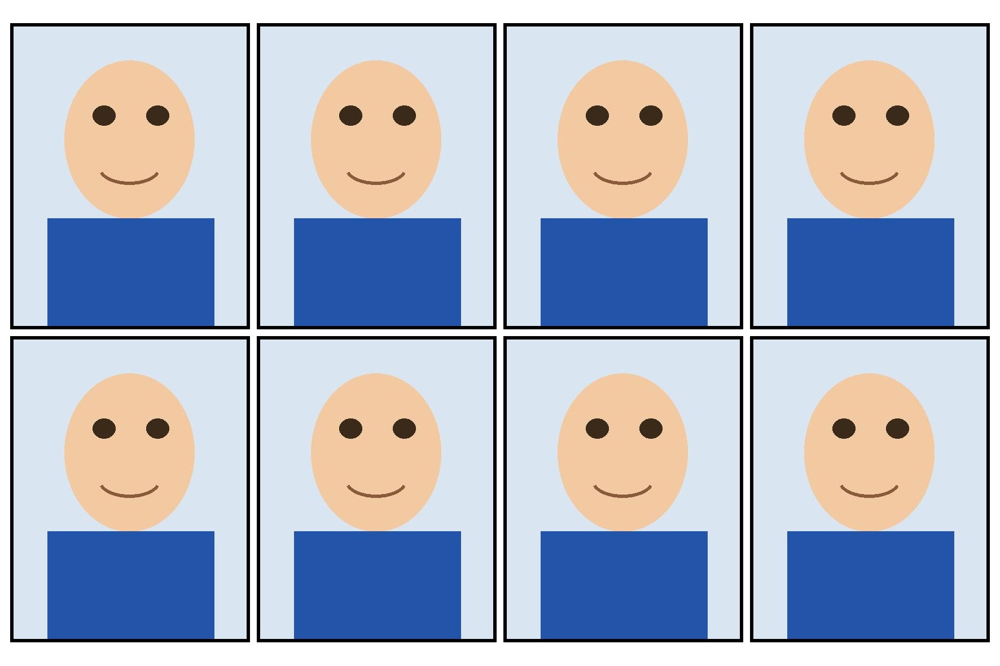

# Passport Photo Print Layout

Tile a single passport / ID / visa photo onto a standard **10x15 cm (4x6")**
print sheet, ready to upload to a self-service photo kiosk or print
machine (e.g. Kruidvat, dm, CEWE, Walgreens, etc.) as a normal 10x15 photo.

- **100% local** — a small Python script using only [Pillow](https://pillow.readthedocs.io/). No cloud upload, no web service, your photo never leaves your machine.
- Adds a thin **black border** around each photo.
- Leaves a **tiny gap** between photos so you can cut them apart cleanly.
- Auto-centers the grid on the sheet and picks portrait/landscape automatically to fit as many copies as possible (8x by default for a standard 35x45mm photo).
- Output is a flat JPEG sized exactly 10x15cm at 300 DPI (or whatever DPI/size you choose), so it prints at the correct physical dimensions without any extra scaling/cropping by the kiosk.

## Example

With a standard 35x45mm photo, the defaults produce a 4x2 grid (8 photos)
on a 10x15cm sheet:



(The face above is a synthetic placeholder graphic used for documentation —
not a real photo.)

## Requirements

- Python 3.9+
- Pillow

```bash
pip install -r requirements.txt
```

## Usage

```bash
python3 passport_layout.py path/to/photo.jpg -o print-sheet.jpg
```

This uses sensible defaults:

| Option | Default | Meaning |
|---|---|---|
| `--photo-width-mm` / `--photo-height-mm` | 35 / 45 | Physical size each photo is scaled to fit (standard passport photo size for most countries incl. EU/UK/India; override if your country uses a different spec, e.g. US passport uses 50x50mm/2x2in). |
| `--page-width-mm` / `--page-height-mm` | 100 / 150 | Print sheet size (10x15cm = standard "4R"/4x6" photo print). |
| `--border-mm` | 0.5 | Black border thickness around each photo. |
| `--gap-mm` | 1.0 | Tiny gap between photos, for cutting. |
| `--margin-mm` | 1.5 | Margin from the sheet edge (keeps the grid away from areas some borderless printers trim). |
| `--dpi` | 300 | Output resolution. |
| `--orientation` | auto | `auto` picks whichever of portrait/landscape fits more copies; or force `portrait`/`landscape`. |
| `--copies` | (fill sheet) | Limit the number of photos placed, e.g. `--copies 4`. |
| `--border-color` / `--bg-color` | black / white | Customize colors. |

Run `python3 passport_layout.py --help` for the full list.

### Example: different photo size

```bash
# US passport (2x2 inch = 50.8x50.8mm)
python3 passport_layout.py photo.jpg -o print-sheet.jpg \
  --photo-width-mm 50.8 --photo-height-mm 50.8
```

## How it works

1. The source photo is scaled (preserving aspect ratio, not cropped) to
   exactly fit `--photo-width-mm` x `--photo-height-mm`.
2. A black-bordered "cell" is built around it (`--border-mm` thick).
3. Cells are tiled in a grid with `--gap-mm` spacing and `--margin-mm` page
   margins, centered on a `--page-width-mm` x `--page-height-mm` canvas.
4. The result is saved as a single flat JPEG at `--dpi`, with the DPI tag
   embedded so it prints at the correct physical size.

## Printing at Kruidvat (or similar kiosks)

Upload the generated `print-sheet.jpg` and order a single **10x15cm**
print. Because the file is already sized exactly 10x15cm at 300 DPI, the
kiosk should print it 1:1 without stretching. Some borderless printers trim
a millimeter or two off each edge — the default 1.5mm margin leaves a small
safety buffer for that.

## Privacy

This tool does not upload, transmit, or log your photo anywhere. It only
reads the input file and writes the output file you specify, on your own
machine.

## License

MIT
